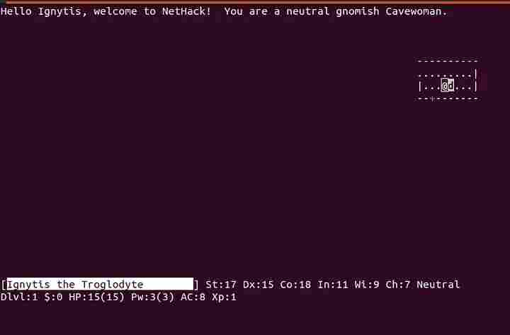
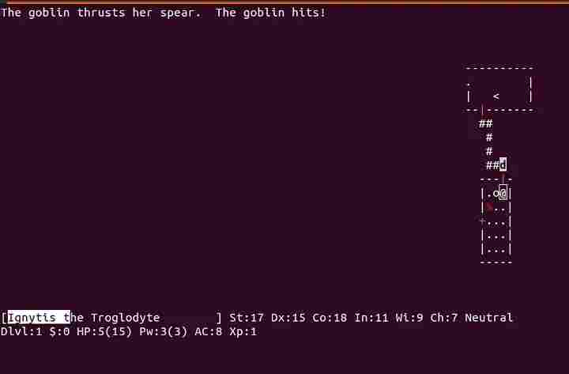
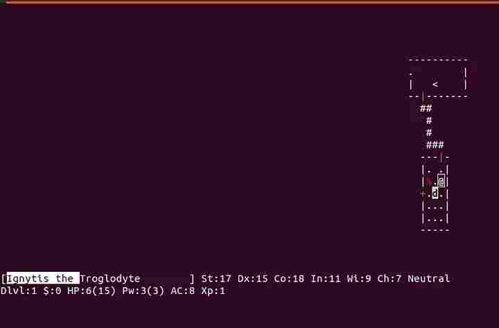
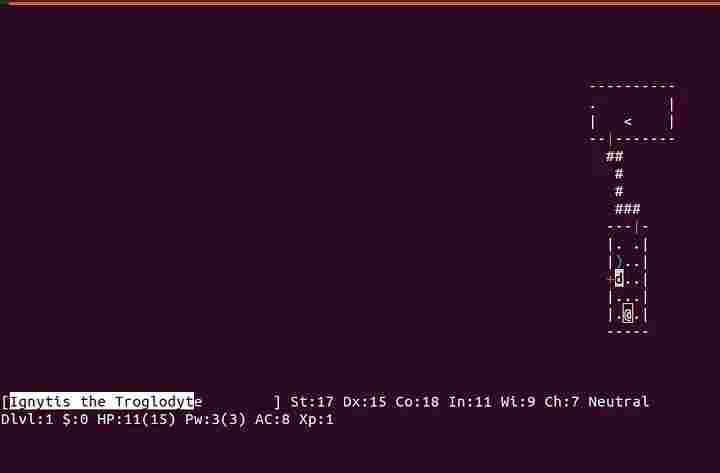
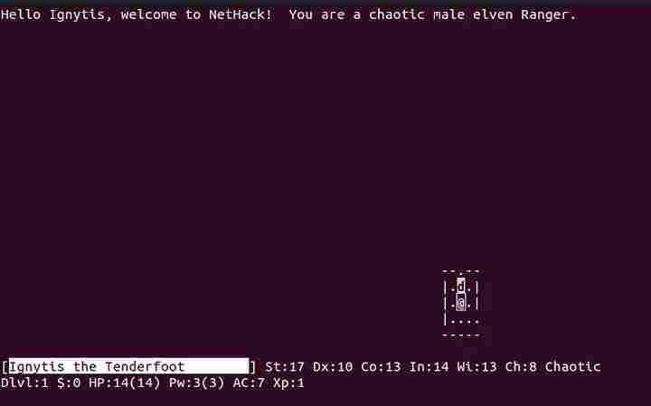
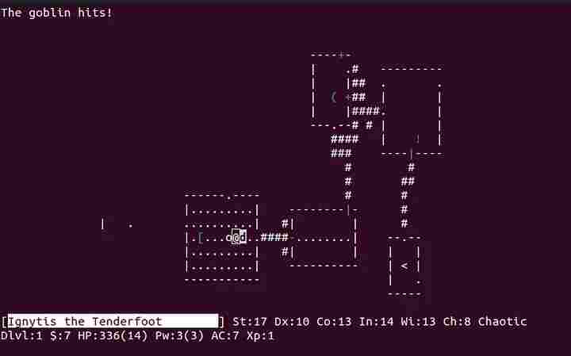
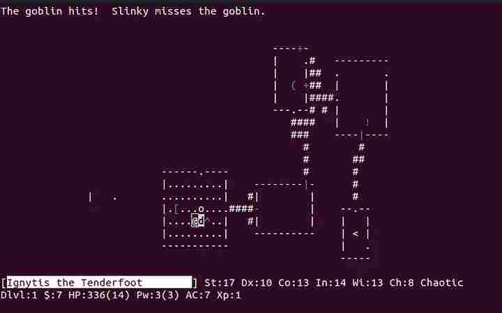

During my university years I had a hobby — to hack simple games for Windows using [OllyDbg](https://www.ollydbg.de/) and [IDA Pro](https://hex-rays.com/ida-pro/).
Not so long time ago I’ve got an idea to try something similar, but in Linux and preferably using just standard tools.
Finally, it was decided to take some application as an object of experiment, and my final choice was Nethack.
There are few reasons why I picked it:
1. License. Nethack is opensource software, so I am free to learn how it works and to modify it.
1. The binary is not “corrupted” by any protectors or packers. Not sure if such tools exist in Linux, but at least in Windows they cause too many troubles with debugging
1. It’s a relatively small and simple application in comparison with 3D games or large tools like LibreOffice
1. It’s fun to hack games!

# The goal

As in many other games, player has a health indicator. When damage is taken from in-game characters or traps, the number of hitpoints decreases. If it reaches zero, the game is over. Our goal is to modify the game binary so that player’s hitpoints never decrease.

# How we would approach to the goal

First, we need to locate a memory address where Nethack stores the value of player’s hitpoints. To find out the address, we will need to take a few dumps of the process memory and check which address stores the actual value in each dump. After that we should locate machine instructions which refer to this address and replace them with something different.

# Apps and Tools
- nethack-console (the game itself)

- GNU Debugger (gdb)
- Python v3
- Bash and commands like _grep_, _head_, etc

# The process

## Install the game

Let’s install the game and check versions of software (OS and the game).
We will have more chances to have a similar output if versions of software do match.

```bash
# lsb_release -a
No LSB modules are available.
Distributor ID: Ubuntu
Description: Ubuntu 22.04.1 LTS
Release: 22.04
Codename: jammy

# apt install nethack-console

# apt show nethack-console
Package: nethack-console
Version: 3.6.6-2build1
```

## Start a debug session
In the first, the __nethack__ command is NOT an executable file, hence it cannot be used as argument for gdb:

```bash
$ gdb nethack
"/usr/games/nethack": not in executable format: file format not recognized
```
“Nethack” is just a script which runs the actual game:

```bash
$ cat /usr/games/nethack        

# some code
HACKSTYLE=console
# some code
HACKDIR=/usr/lib/games/nethack
# some code
HACK=$HACKDIR/nethack-$HACKSTYLE
# some code
exec $HACK "$@"
```
So the real path to the executable file is __/usr/lib/games/nethack/nethack-console__.
Unfortunately, it cannot be started in gdb either due to some tricky problem with file permissions:

```bash
$ gdb /usr/lib/games/nethack/nethack-console
... ...
(gdb) r                                         # run the game
...  ...
Warning: cannot write scoreboard file '/var/games/nethack/record'
Hit return to continue:

... ...
Cannot open file /var/games/nethack/perm.  Is NetHack installed correctly?
Hit space to continue:
```

Alright, let’s attach to a running game then. To attach to another process, superuser’s permissions are required:

```bash
# terminal 1
$ nethack

# terminal 2
$ ps aux | grep nethack
user     12485  0.0  0.0   6040  4756 pts/0    S+   21:54   0:00 /usr/lib/games/nethack/nethack-console -u Ignytis

$ sudo gdb -p 12485
```

Inside the game terminal you’ll need to start a new game and pick a character.
I would recommend to pick a random one by pressing _y_.
When _gdb_ starts, it will automatically pause the game process, so you will need to resume it by typing _c_:

```bash
Attaching to process 12485
Reading symbols from /usr/lib/games/nethack/nethack-console...
(No debugging symbols found in /usr/lib/games/nethack/nethack-console)
Reading symbols from /lib/x86_64-linux-gnu/libncurses.so.6...
(No debugging symbols found in /lib/x86_64-linux-gnu/libncurses.so.6)
Reading symbols from /lib/x86_64-linux-gnu/libtinfo.so.6...
(No debugging symbols found in /lib/x86_64-linux-gnu/libtinfo.so.6)
Reading symbols from /lib/x86_64-linux-gnu/libc.so.6...
Reading symbols from /usr/lib/debug/.build-id/69/389d485a9793dbe873f0ea2c93e02efaa9aa3d.debug...
Reading symbols from /lib64/ld-linux-x86-64.so.2...
Reading symbols from /usr/lib/debug/.build-id/61/ef896a699bb1c2e4e231642b2e1688b2f1a61e.debug...
[Thread debugging using libthread_db enabled]
Using host libthread_db library "/lib/x86_64-linux-gnu/libthread_db.so.1".
0x00007f2ac840d992 in __GI___libc_read (fd=0, buf=0x562de5d933b0, nbytes=1024) at ../sysdeps/unix/sysv/linux/read.c:26
26 ../sysdeps/unix/sysv/linux/read.c: No such file or directory.

(gdb) c
Continuing.
```

# Locate a value to look up in memory
So, the game. On the bottom we can observe the current and maximum number of hitpoints: 15(15).
This is what we need to search in memory.



The process of finding the correct value is not very straightforward.
There are lots of irrelevant memory blocks which have value 15, including but not limited to non-initialized variables,
internal calculations, timers, etc. On the screenshot above you can also see some values which are not current hitpoints.
There are maximum hitpoints in brackets and some _Dx: 15_ record which is most likely a dexterity attribute of the character.
To filter out irrelevant values, we should:
1. Look up _15_ in memory
1. Commit some action(s) to have hitpoints changed i.e. take some damage
1. Lookup a new value in memory
1. Check which memory address does NOT change between scans
1. Repeat steps 2–4 in case if there are several “candidate” addresses displayed

## Making a memory dump
The format of dump command in gdb is:

```
dump binary memory /path/to/output/dump/file start_address end_address
```

In order to get the start and end address we need to query process _memory mappings_.
Press __CTRL+C__ in gdb window to pause the game process and to switch to interactive mode in gdb:

```
(gdb)
^C
Program received signal SIGINT, Interrupt.
0x00007f2ac840d992 in __GI___libc_read (fd=0, buf=0x562de5d933b0, nbytes=1024) at ../sysdeps/unix/sysv/linux/read.c:26
26 in ../sysdeps/unix/sysv/linux/read.c


(gdb) info proc mappings
process 12485
Mapped address spaces:

          Start Addr           End Addr       Size     Offset  Perms  objfile
      0x562de527b000     0x562de52a0000    0x25000        0x0  r--p   /usr/lib/games/nethack/nethack-console
      0x562de52a0000     0x562de5499000   0x1f9000    0x25000  r-xp   /usr/lib/games/nethack/nethack-console
      0x562de5499000     0x562de5512000    0x79000   0x21e000  r--p   /usr/lib/games/nethack/nethack-console
      0x562de5512000     0x562de551d000     0xb000   0x296000  r--p   /usr/lib/games/nethack/nethack-console
      0x562de551d000     0x562de5532000    0x15000   0x2a1000  rw-p   /usr/lib/games/nethack/nethack-console
      0x562de5532000     0x562de5558000    0x26000        0x0  rw-p   
      0x562de5d83000     0x562de5da4000    0x21000        0x0  rw-p   [heap]
      0x7f2ac82f7000     0x7f2ac82f9000     0x2000        0x0  rw-p   
      0x7f2ac82f9000     0x7f2ac8321000    0x28000        0x0  r--p   /usr/lib/x86_64-linux-gnu/libc.so.6
      0x7f2ac8321000     0x7f2ac84b6000   0x195000    0x28000  r-xp   /usr/lib/x86_64-linux-gnu/libc.so.6
      0x7f2ac84b6000     0x7f2ac850e000    0x58000   0x1bd000  r--p   /usr/lib/x86_64-linux-gnu/libc.so.6
      0x7f2ac850e000     0x7f2ac8512000     0x4000   0x214000  r--p   /usr/lib/x86_64-linux-gnu/libc.so.6
      0x7f2ac8512000     0x7f2ac8514000     0x2000   0x218000  rw-p   /usr/lib/x86_64-linux-gnu/libc.so.6
      0x7f2ac8514000     0x7f2ac8521000     0xd000        0x0  rw-p   
      0x7f2ac8521000     0x7f2ac852f000     0xe000        0x0  r--p   /usr/lib/x86_64-linux-gnu/libtinfo.so.6.3
      0x7f2ac852f000     0x7f2ac8540000    0x11000     0xe000  r-xp   /usr/lib/x86_64-linux-gnu/libtinfo.so.6.3
      0x7f2ac8540000     0x7f2ac854e000     0xe000    0x1f000  r--p   /usr/lib/x86_64-linux-gnu/libtinfo.so.6.3
      0x7f2ac854e000     0x7f2ac8552000     0x4000    0x2c000  r--p   /usr/lib/x86_64-linux-gnu/libtinfo.so.6.3
      0x7f2ac8552000     0x7f2ac8553000     0x1000    0x30000  rw-p   /usr/lib/x86_64-linux-gnu/libtinfo.so.6.3
      0x7f2ac8553000     0x7f2ac855a000     0x7000        0x0  r--p   /usr/lib/x86_64-linux-gnu/libncurses.so.6.3
      0x7f2ac855a000     0x7f2ac8573000    0x19000     0x7000  r-xp   /usr/lib/x86_64-linux-gnu/libncurses.so.6.3
      0x7f2ac8573000     0x7f2ac8579000     0x6000    0x20000  r--p   /usr/lib/x86_64-linux-gnu/libncurses.so.6.3
      0x7f2ac8579000     0x7f2ac857a000     0x1000    0x25000  r--p   /usr/lib/x86_64-linux-gnu/libncurses.so.6.3
      0x7f2ac857a000     0x7f2ac857b000     0x1000    0x26000  rw-p   /usr/lib/x86_64-linux-gnu/libncurses.so.6.3
      0x7f2ac8597000     0x7f2ac8599000     0x2000        0x0  rw-p   
      0x7f2ac8599000     0x7f2ac859b000     0x2000        0x0  r--p   /usr/lib/x86_64-linux-gnu/ld-linux-x86-64.so.2
      0x7f2ac859b000     0x7f2ac85c5000    0x2a000     0x2000  r-xp   /usr/lib/x86_64-linux-gnu/ld-linux-x86-64.so.2
      0x7f2ac85c5000     0x7f2ac85d0000     0xb000    0x2c000  r--p   /usr/lib/x86_64-linux-gnu/ld-linux-x86-64.so.2
      0x7f2ac85d1000     0x7f2ac85d3000     0x2000    0x37000  r--p   /usr/lib/x86_64-linux-gnu/ld-linux-x86-64.so.2
      0x7f2ac85d3000     0x7f2ac85d5000     0x2000    0x39000  rw-p   /usr/lib/x86_64-linux-gnu/ld-linux-x86-64.so.2
      0x7ffd1367a000     0x7ffd1369b000    0x21000        0x0  rw-p   [stack]
      0x7ffd137ad000     0x7ffd137b1000     0x4000        0x0  r--p   [vvar]
      0x7ffd137b1000     0x7ffd137b3000     0x2000        0x0  r-xp   [vdso]
  0xffffffffff600000 0xffffffffff601000     0x1000        0x0  --xp   [vsyscall]
```

Here are memory addresses for different components of the game. Some blocks are reserved for external libraries.
All lines except the last one have a reading permission (_r_ letter in _Perms_ column).
However, gdb cannot just take dump of this entire memory and crashes with error message:

```
(gdb) dump binary memory /tmp/memdump_000.bin 0x562de527b000 0x7ffd137b3000
/build/gdb-ZgDh0V/gdb-12.1/gdb/utils.c:712: internal-error: virtual memory exhausted: can't allocate 45969812193280 bytes.
A problem internal to GDB has been detected,
further debugging may prove unreliable.
----- Backtrace -----
0x56523455b077 ???
0x5652348bfa64 ???
0x5652348bfca0 ???
0x565234a0f0e4 ???
0x5652348bb0e2 ???
0x565234a12f0a ???
0x5652345940d9 ???
0x565234590654 ???
0x565234886394 ???
0x56523465e9a4 ???
0x56523465ed43 ???
0x56523465f4c6 ???
0x7ff50f890e0d ???
0x56523465da95 ???
0x56523465f374 ???
0x56523465d68b ???
0x565234a0f815 ???
0x565234a0fcaa ???
0x56523471b36c ???
0x56523471d054 ???
0x5652344b315f ???
0x7ff50e80bd8f __libc_start_call_main
 ../sysdeps/nptl/libc_start_call_main.h:58
0x7ff50e80be3f __libc_start_main_impl
 ../csu/libc-start.c:392
0x5652344b8bf4 ???
0xffffffffffffffff ???
---------------------
/build/gdb-ZgDh0V/gdb-12.1/gdb/utils.c:712: internal-error: virtual memory exhausted: can't allocate 45969812193280 bytes.
A problem internal to GDB has been detected,
further debugging may prove unreliable.
Quit this debugging session? (y or n)
```

Alright, let’s try to take a memory dump from the first address space until end of the last block before _\[heap\]_ mapping:

```
(gdb) dump binary memory /tmp/memdump_000.bin 0x562de527b000 0x562de5558000
(gdb)
```
It succeeded. Now we have a memory dump in __/tmp/memdump_000.bin__ file:

```
$ head -c 20 /tmp/memdump_000.bin | hexdump
0000000 457f 464c 0102 0001 0000 0000 0000 0000
0000010 0003 003e                              
0000014
```
Now let’s decrease the character’s hitpoints in game by having some fight or stepping into a trap:



Here we go. The goblin leaves us with 5 out of 15 hitpoints just with one hit.
Let’s take a memory dump once again, but into ANOTHER file:

```
(gdb)
^C
Program received signal SIGINT, Interrupt.
0x00007f2ac840d992 in __GI___libc_read (fd=0, buf=0x562de5d933b0, nbytes=1024) at ../sysdeps/unix/sysv/linux/read.c:26
26 in ../sysdeps/unix/sysv/linux/read.c


(gdb) dump binary memory /tmp/memdump_001.bin 0x562de527b000 0x562de5558000
(gdb)
```

## Locating the memory address
At this point we have two memory dumps.
The first one is supposed to contain a value “15” and the second one must have a value “05” at the same offset.
To be honest, I don’t have any good program to compare memory dumps on my mind, so let’s create a small Python script which will find out the needed offset:

```python
#! /usr/bin/env python3

f1 = open('/tmp/memdump_000.bin', 'rb')  # the first dump
f2 = open('/tmp/memdump_001.bin', 'rb')  # the second dump

token_1 = b'\x0f'   # the first value of hitpoints '15', or 'f' in hexadecimal notation
token_2 = b'\x05'   # the second value of hitpoints, or '5'

offset = 0
while True:
  byte_1 = f1.read(1) # read both files by one byte each
  byte_2 = f2.read(1)
  if not byte_1 or not byte_2: # stop on end of any file
      break

  if byte_1 == token_1 and byte_2 == token_2:  # if both bytes match at current offset...
      print(f"MATCH at {offset:x}")            # print the offset in hexadecimal format

  offset += 1
```
The result of this script is:

```bash
$ python3 ./find_matches.py
MATCH at 2b8350
MATCH at 2baf98
```

Okay, there are two matches found. Good, but still too many. Let’s make one more dump.
Luckily, I survived the goblin and few steps later one hitpoint had been added:



I took one more dump __/tmp/memdump_002.bin__ and adjusted the previous script to compare the second dump with the third:

```python   
f1 = open('/tmp/memdump_001.bin', 'rb')
f2 = open('/tmp/memdump_002.bin', 'rb')

token_1 = b'\x05'
token_2 = b'\x06'

# the rest of the code is the same
```

Running again, and finally:

```bash
$   python3 ./find_matches.py
MATCH at 2baf98
```

Now we have a hypothesis that the offset __0x2baf98__ contains the actual value of hitpoints.

## Verifying the located address

Before committing any changes, let’s verify if this address is actually responsible for hitpoints.
We can use gdb to update this address and check how it will affect the game.
The trick is that we found a __relative__ address, but we need to know a __mapped__ address for the current application.
It could be easily calculated by adding the relative offset __0x2baf98__ to start address we were taking dumps from, or __0x562de527b000__.
0x562de527b000 + 0x2baf98 = 0x562DE5535F98, according to the hexadecimal calculator.
Let’s check the value of this address in gdb:

```
(gdb) print *0x562DE5535F98
$1 = 6
```

We have 6 HP currently, so it looks legit, right? Now let’s change it and grant our character 10 hitpoints (or _0x0a_ in HEX):

```
(gdb) set *0x562DE5535F98 = 0x0a
(gdb) c
Continuing.
```

Again, the displayable value doesn’t refresh instantly. After a while I’ve got 11 hitpoints.
10 HP was given by debugger and one more HP by auto-healing. So, we did it.



# Patching the game

To start with patching, we need to figure out machine instructions which refer to the discovered memory address.
Luckily, the __objdump__ tool adds this kind of offsets to comments in disassembly. Let’s disassemble the game:

```bash
$ objdump -Sd -M intel /usr/lib/games/nethack/nethack-console > /tmp/nethack.asm
```

Now we can search the __0x2baf98__ address in disassembly. I provide only 5 lines here, as the entire output is quite large:

```bash
$ grep "2baf98" /tmp/nethack.asm | head -n 5 
   26682: c7 05 0c 49 29 00 01  mov    DWORD PTR [rip+0x29490c],0x1        # 2baf98 <stderr@GLIBC_2.2.5+0x4778>
   27930: 8b 35 62 36 29 00     mov    esi,DWORD PTR [rip+0x293662]        # 2baf98 <stderr@GLIBC_2.2.5+0x4778>
   2817d: 89 05 15 2e 29 00     mov    DWORD PTR [rip+0x292e15],eax        # 2baf98 <stderr@GLIBC_2.2.5+0x4778>
   2818b: 8b 05 07 2e 29 00     mov    eax,DWORD PTR [rip+0x292e07]        # 2baf98 <stderr@GLIBC_2.2.5+0x4778>
   281a4: 89 05 ee 2d 29 00     mov    DWORD PTR [rip+0x292dee],eax        # 2baf98 <stderr@GLIBC_2.2.5+0x4778>
```

There are many instructions related to a memory block which supposedly stores hitpoints.
However, we need only those instructions which assign a value to hitpoints. In assembly the assignment operation typically looks like

```
mov source, destination
```

Perhaps there are more ways to assign a value, but let’s start with this one (spoiler: it will be enough to check this one).
As you can see from sample content of __/tmp/nethack.asm__ file, the format of MOV operation to assign a value to __0x2baf98__ address typically looks like

```
mov some_source, DWORD PTR [rip+some_relative_offset_here]     # relative address
```

Let’s find such instructions using a regular expression and save them to a file:

```bash
$ grep -i "# 2baf98" /tmp/nethack.asm | egrep "mov .+,DWORD" > /tmp/mov_instructions.txt
$ cat /tmp/mov_instructions.txt | head -n 5
   27930: 8b 35 62 36 29 00     mov    esi,DWORD PTR [rip+0x293662]        # 2baf98 <stderr@GLIBC_2.2.5+0x4778>
   2818b: 8b 05 07 2e 29 00     mov    eax,DWORD PTR [rip+0x292e07]        # 2baf98 <stderr@GLIBC_2.2.5+0x4778>
   28352: 8b 35 40 2c 29 00     mov    esi,DWORD PTR [rip+0x292c40]        # 2baf98 <stderr@GLIBC_2.2.5+0x4778>
   28388: 8b 35 0a 2c 29 00     mov    esi,DWORD PTR [rip+0x292c0a]        # 2baf98 <stderr@GLIBC_2.2.5+0x4778>
   283a3: 8b 35 ef 2b 29 00     mov    esi,DWORD PTR [rip+0x292bef]        # 2baf98 <stderr@GLIBC_2.2.5+0x4778>
```
Perfect. Now we need to replace these instructions with something which will prevent hitpoints from changing.
There is a NOP (No operation) operator in assembly which says to the program basically to do nothing.
We could replace all these instructions with this operator which op-code is __0x90__.
One option is to do it manually using HEX-editor.
Honestly, I tried it, but got annoyed very quickly and stopped trying after something like 10 instructions.
In addition, the updated program had crashed, most likely because I made a typo somewhere.
Instead of this, we can make another Python script which will do the job.
Please take a look at the previous snippet. The program needs to:

1. Open the binary file
1. Read a line from filtered disassembly file _/tmp/mov_instructions.txt_
1. Go to offset provided in beginning of the line (e.g. 0x27930)
1. Replace as many bytes with 0x90 as many HEX-codes we have before the “mov” keyword. In the provided example there are always 6 HEX-codes, but it might be different for other instructions.
1. Go to step 2 unless the whole disassembly file is processed

Here is the code:

```python
#! /usr/bin/env python3

with open('/tmp/mov_instructions.txt', 'r') as f_i, open('/usr/lib/games/nethack/nethack-console', 'r+b') as f_o:
    for i_line_src in f_i.readlines():
        i_line = i_line_src.strip() # example: 27930: 8b 35 62 36 29 00     mov    esi,DWORD PTR [rip+0x293662]
        i_line = i_line.split("mov")[0].split(":") # example: list with two items: 27930 and 8b 35 62 36 29 00
        addr = i_line[0].strip()  # example: 27930
        addr = int(addr, 16)      # convert the string into integer (HEX)
        bts = i_line[1].strip()   # example: 8b 35 62 36 29 00
        num_bts = len(bts.split(' '))  # example: 6
        nop_bytes = bytes([0x90] * num_bts) # creates a list of bytes like {0x90, 0x90, 0x90, 0x90, 0x90, 0x90}
            
        f_o.seek(addr)  # go to calculated offset
        f_o.write(nop_bytes)  # write bytes
```

After you run this file (NB: use sudo, as superuser permission is needed) the game must have been patched.

## Running the patched game



Okay, at first sight nothing changed. Let’s find some trouble in the labyrinth.



As you can see, I got some slap from goblin, but instead of decreasing, hitpoints exceeded the maximum amount.
I think the reason is that 336 is a real value of hitpoints,
but in the beginning the game just rendered the same number of hitpoints as the maximum number.
After taking some damage, the text label renders again and reads the real value.

Why 336 though? My best guess is that we had eliminated all value assignments,
therefore the number of HP is not initialized in the beginning of the game.
As a result, it uses a value which was previously saved to the corresponding memory block by any other process.
We can try to make it the same as the maximum number of HP, but it would require more effort :)



But anyway, we achieved the desired result — now the character is invulnerable to damage.
Nevertheless, they might die from other factors like starvation.
Of course, it could be patched as well, but, again, it would require more detailed research.
In fact, the level of starvation (if there is any) is not displayed in the game, so it might be a more challenging update.

That’s basically it. I hope that this article was useful for you to understand some basics of debugging the compiled apps in Linux :)