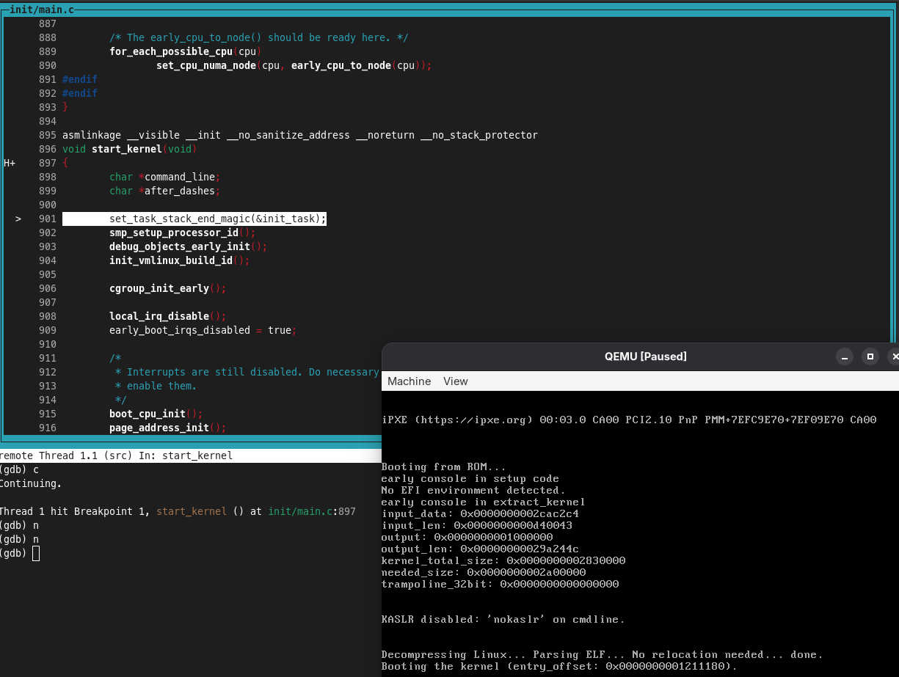

# Considerations

- Ubuntu Server 24.04.2 (x64) is used as a guest system
- Host system: Linux (x64). At the moment of writing the article I used Fedora Workstation 42
- At some point we will need Docker to compile a binary to handle one issue

# The roadmap

1. Compile the kernel
1. Build initial RAM disk
   - Compile Busybox
   - Make an initial RAM disk file _a.k.a. initrd_
1. Install the OS in virtual machine
1. Boot the virtual machine with compiled kernel + initial RAM disk
1. Attach GDB to running machine


# Compilation of Linux Kernel

## How to obtain the code

The code can be pulled from [Github mirror](https://github.com/torvalds/linux)
```bash
git clone git@github.com:torvalds/linux.git
```
...or from [kernel.org](https://git.kernel.org/pub/scm/linux/kernel/git/torvalds/linux.git/), if you prefer the original source:
```bash
git clone git://git.kernel.org/pub/scm/linux/kernel/git/torvalds/linux.git
```

It will take a while, because Kernel has quite a huge history. This would be the __Kernel source directory__.

## Prerequisites

You will need:
- C compiler (`gcc`), of course
- `flex` and `bison` binaries. They are most likely installed to your system, at least I didn't have to install them
- Development version of `ncurses` library to render the configuration menu when running `make menuconfig`.
  In Fedora in can be installed via `dnf install ncurses-devel`
- GNU `make` utility

And that's most likely all. The benefit of Linux kernel development is not being dependent on any other system libraries.
On the opposite, other libraries might depend on Linux Kernel :)

## Configuration

We will need to compile a kernel which is compatible with QEMU and which has debug information for GDB.
Navigate to __Kernel source directory__ and run:
```bash
make x86_64_defconfig
make kvm_guest.config
```
These commands will create a basic `.config` file which is configured for x64 system
and which has components for KVM virtualization that we will use in QEMU.
We only need to enable the debug information in the kernel:

```bash
make menuconfig
```

This will display a TUI menu where you need to navigate to `Kernel hacking` (it must be the last item).
Verify if `Kernel debugging` is enabled. Then go to `Compile-time checks and compiler options` &gt; 
`Debug information (Generate DWARF Version 5 debuginfo)` sub-level and set the `Generate DWARF Version 5 debuginfo` option.
Now you can save the config and exit from configuration utility.

### Rename the kernel (optional)

How cool it will be to have your name in the kernel info?
In addition, it will be a way to ensure that the loaded kernel is your custom one.
To set a custom version name, you can edit the `Makefile` and assign some suffix to `EXTRAVERSION` parameter in beginning of the file.
The initial value is something like `-rc4`, so you can make it `-john-doe-edition`.
It will be observable via `uname -a` in the future.


## Building the kernel

```bash
make -j$(nproc)
```

The `-j$(nproc)` argument will resolve to `-j<number_of_your_cpu_cores>` which will significantly improve the time of compilation.
Compilation might be time consuming, especially if your CPU doesn't have manu cores.
It might take even hours if you skip the CPU number parameter. But in my case (16 cores) it took probably 10 minutes.


When the compilation completes, there should be output like
```bash
Kernel: arch/x86/boot/bzImage is ready
```

This is your kernel. To avoid any confusion - there is also `arch/x86/boot/bzImage` file, but it is just a symlink to `arch/x86/boot/bzImage`.


# Making initrd

Linux kernel needs an initial filesystem to bootstrap, so let's build it.

## Compilation of Busybox

Busybox combines lots of basic utilities in one binary file, that's why it's so useful to bootstrap the Linux system.
Our goal is to include Busybox into initial ramdisk.

The source code of Busybox could be pulled from its [official repository](https://git.busybox.net/busybox):
```bash
git clone git://busybox.net/busybox.git
```
Let's call the result directory as __Busybox source directory__.

In __Busybox source directory__, execute
```bash
make menuconfig
```
Navigate to `settings` and set the `Build static binary (no shared libs)` flag, it must be approximately in the middle of menu.
Now Busybox is ready for compilation.

Unfortunalely, there are some issues with compilation of Busybox on desktop system, at least on my Fedora setup.
At least it drops
```bash
networking/tc.c: In function ‘cbq_print_opt’:
networking/tc.c:236:27: error: ‘TCA_CBQ_MAX’ undeclared (first use in this function); did you mean ‘TCA_CBS_MAX’?
  236 |         struct rtattr *tb[TCA_CBQ_MAX+1];

```
Even with [having TC setting disabled](https://lists.busybox.net/pipermail/busybox-cvs/2024-January/041752.html), it drops tons of errors:
```bash
/usr/bin/ld: cannot find -lm: No such file or directory
/usr/bin/ld: have you installed the static version of the m library ?
/usr/bin/ld: cannot find -lresolv: No such file or directory
/usr/bin/ld: have you installed the static version of the resolv library ?
```

As a workaround, I would suggest to build the application inside Docker container.
Execute this command in __Busybox source directory__:

```bash
docker run --rm -it \
  -u "$(id -u):$(id -g)" \
  -v $PWD:/build/busybox \
  -w /build/busybox \
  gcc:15.1.0-bookworm \
  sh -c "make clean && make -j$(nproc) && make install"
```
This command will mount the __Busybox source directory__ into `/build/busybox` inside Docker container and will build Busybox there using official GCC Docker image.
The expected output would be like
```bash
# more text here
  ./_install//usr/sbin/ubiupdatevol -> ../../bin/busybox
  ./_install//usr/sbin/udhcpd -> ../../bin/busybox


--------------------------------------------------
You will probably need to make your busybox binary
setuid root to ensure all configured applets will
work properly.
--------------------------------------------------

```

The outcome will be:
- `busybox` binary
- `_install` directory which we will need later

## Now let's make initrd

Create a new directory (we will refer it as __Initrd source directory__).
Then create an `init` file with the following contents:
```bash
#!/bin/sh

mount -t proc none /proc
mount -t sysfs none /sys
mount -t devtmpfs none /dev

# # Note: this might be useful for troubleshooting in case if the guest Linux OS will not load
# # Use it instead of the code below to load basic system in RAM
# cat <<!
# Welcome!
# Boot took $(cut -d' ' -f1 /proc/uptime) seconds
# !
# exec /bin/sh

# This code mounts the Ubuntu partition into /mnt and switches to it
mkdir /mnt
mount /dev/vda2 /mnt
exec switch_root /mnt /sbin/init
```
This file will be loaded on system boot.

Now create a directory with the structure of RAM filesystem; replace the !busybox_src! with path to __Busybox source directory__:
```bash
# Create a rootfs directory with contents
mkdir -pv rootfs/{bin,sbin,aetc,proc,sys,usr/{bin,sbin},dev}
# Copy the binaries into rootfs directory
cp -av !busybox_src!/_install/* rootfs/
# Copy the init file into rootfs directory and make it executable
cp init rootfs/init
chmod +x rootfs/init
```
Finally, create a `rootfs.cpio.gz` file with the contents of rootfs:
```bash
# Navigate to rootfs directory
cd rootfs
find . -print0 | cpio --null -ov --format=newc | gzip -9 > ../rootfs.cpio.gz
```

# Setting up the virtual machine

Let's create yet another new directory which is __Guest OS directory__.
It will contain files which are necessary for installation of Ubuntu Server into QEMU virtual machine.
Go to this directory and download an ISO image of Ubuntu Server:
```bash
wget https://releases.ubuntu.com/24.04.2/ubuntu-24.04.2-live-server-amd64.iso
```

Now let's create a virtual hard drive where we will install Ubuntu to:
```
qemu-img create disk.qcow2 10G -f qcow2
```
This will create a `disk.qcow2` file which will be a 10 gigabyte disk in [qcow format](https://en.wikipedia.org/wiki/Qcow).

Finally, start a virtual machine with ISO image + virtual disk mounted. `!guest_dir!` should be replaced with path to __Guest OS directory__.
```bash
qemu-system-x86_64 \
    -enable-kvm \
    -m 2048 \
    -cpu host \
    -smp 2 \
    -drive file=!guest_dir!/disk.qcow2,format=qcow2,if=virtio \
    -cdrom !guest_dir!/ubuntu-24.04.2-live-server-amd64.iso\
    -net nic \
    -net user \
    -vga std \
    -boot d
```
This command will open a window with virtual machine which uses 2 CPU cores (`-smp 2`) and 2GB RAM (`-m 2048`). Proceed with installation of Ubuntu.

__NB!__ When configuring disk partitions, do __NOT__ enable the disk encryption (LUKS; it might be enabled by default), because you will not be able to mount it later.

When installer requests to reboot the system, you can just close the window with VM.

To verify the installation, you can run the previous command again, but with `-cdrom` and `-boot` options removed in order to skip the ISO disk part:
```bash
qemu-system-x86_64 \
    -enable-kvm \
    -m 2048 \
    -cpu host \
    -smp 2 \
    -drive file=!guest_dir!/disk.qcow2,format=qcow2,if=virtio \
    -net nic \
    -net user \
    -vga std
```
Now the system must boot from virtual disk.

To verify if virtual disk had been created correctly, check the list of disks (`df -h`) after login to the guest system. There must be `/dev/vda2` disk mounted to `/`.
If there are paths like `/dev/mapper/..` then you most likely missed the previous __"NB"__ block and created the encrypted disk.

# Booting the compiled kernel

Now let's adjust the previous command to boot your kernel. Please don't forget to replace:
- `!guest_dir!` &gt; __Guest OS directory__
- `!initrd_dir!` &gt; __Initrd source directory__
- `!kernel_dir!` &gt; __Kernel source directory__

```bash
qemu-system-x86_64 \
    -enable-kvm \
    -m 2048 \
    -cpu host \
    -smp 2 \
    -drive file=!guest_dir!/disk2.qcow2,format=qcow2,if=virtio \
    -append "root=/dev/vda2 console=ttyS0 earlyprintk=vga debug initcall_debug nokaslr net.ifnames=0 biosdevname=0" \
    -initrd !initrd_dir!/rootfs.cpio.gz \
    -kernel !kernel_dir!/arch/x86_64/boot/bzImage \
    -vga std
```
If everything went well, it should start as usual. Now, if you type:
```bash
uname -a
```
it should display the version of compiled kernel. If you added some your custom input, as suggested in beginning of article, it should be printed too.

# Debugging the kernel

The last step is to enable debugging in the running machine:
```bash
qemu-system-x86_64 \
    -enable-kvm \
    -m 2048 \
    -cpu host \
    -smp 2 \
    -drive file=!guest_dir!/disk2.qcow2,format=qcow2,if=virtio \
    -append "root=/dev/vda2 console=ttyS0 earlyprintk=vga debug initcall_debug nokaslr net.ifnames=0 biosdevname=0" \
    -initrd !initrd_dir!/rootfs.cpio.gz \
    -kernel !kernel_dir!/arch/x86_64/boot/bzImage \
    -vga std \
    -s -S
```
`-s -S` flags start a GDB server at port `1234` and halt the machine on startup. After running command, you will see a message:

> Guest has not initialized the display (yet)

So execution had stopped even before display was initialized. Now in __Kernel source directory__ run this:
```bash
gdb -tui vmlinux
```
Inside GDB session, let's connect to GDB server which we had started on port `1234` and add a hardware-assisted breakpoint on `start_kernel` function:
```bash
target remote :1234
hb start_kernel
```

After setting a breakpoint, you can resume the execution by sending `c` command to GDB. Some text will be printed in QEMU window and GDB will freeze in beginning
of `start_kernel` function. Send a `n` command a couple of times to execute few lines of the code. Your GDB and QEMU windows will look like this:



If you have approximately the same result, then congratulations, you can debug the kernel now!

# Kudos
- https://www.youtube.com/@johannes4gnu_linux96 for this [video about compilation of Kernel, Busybox and building the rootfs](https://www.youtube.com/watch?v=LyWlpuntdU4)
- https://www.youtube.com/@hexdump1337 for [one more video about kernel, busybox and qemu](https://www.youtube.com/watch?v=4PdMZd0Bt7c)
- https://www.youtube.com/@ghostinthehive2027 for [video about debugging the kernel in GDB](https://www.youtube.com/watch?v=2VcA5Wj7IvU)
- https://gist.github.com/chrisdone for providing [examples of initrd scripts](https://gist.github.com/chrisdone/02e165a0004be33734ac2334f215380e)
- https://lukaszgemborowski.github.io for [article with instructions about compilation of initrd](https://lukaszgemborowski.github.io/articles/minimalistic-linux-system-on-qemu-arm.html)
- [ChatGPT](https://chatgpt.com/) for solving my networking issues inside qemu VM